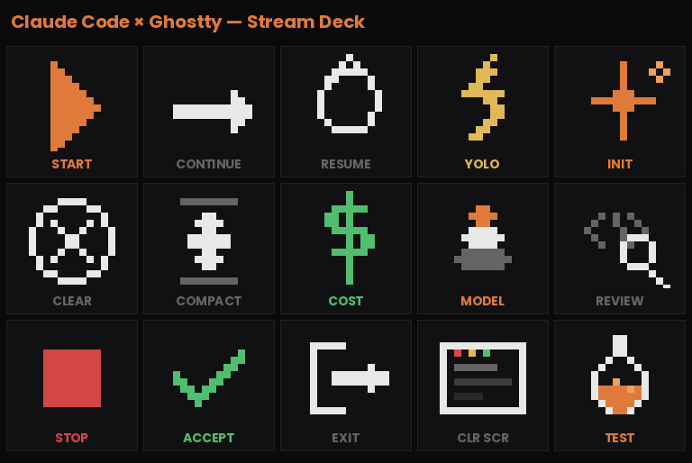

# Claude Code + Ghostty — Stream Deck Setup

Stream Deck profile for controlling Claude Code in [Ghostty](https://ghostty.org).

Row 1 buttons open Ghostty and launch a Claude Code session. Rows 2–3 send slash commands and hotkeys to an active session.



## Layout (5x3 Grid)

| Col 1 | Col 2 | Col 3 | Col 4 | Col 5 |
|-------|-------|-------|-------|-------|
| START | CONTINUE | RESUME | YOLO | INIT |
| CLEAR | COMPACT | COST | MODEL | REVIEW |
| STOP | ACCEPT | EXIT | CLR SCR | RETURN |

## Quick Setup

Run the config generator to write button actions and icons directly into your Stream Deck profile:

```bash
python3 generate_config.py
```

Then restart the Stream Deck app to apply.

## Manual Setup

### Icons

Each icon lives in `../icons/` in two sizes:
- `*_72.png` — 72x72px (native Stream Deck resolution)
- `*.png` — 144x144px (2x retina quality, recommended)

To set an icon: click the icon area on the button, select **"Set from File..."**, and browse to the PNG.

### Row 1: Session Management

Each button opens Ghostty, waits for it to focus, then types a Claude Code launch command.

| Button | Action Type | Config |
|--------|-----------|--------|
| START | Multi Action | Open Ghostty.app → Delay 500ms → Text: `claude` + Enter |
| CONTINUE | Multi Action | Open Ghostty.app → Delay 500ms → Text: `claude -c` + Enter |
| RESUME | Multi Action | Open Ghostty.app → Delay 500ms → Text: `claude --resume` + Enter |
| YOLO | Multi Action | Open Ghostty.app → Delay 500ms → Text: `claude --dangerously-skip-permissions` + Enter |
| INIT | Text | `/init` + Enter |

#### Multi Action Step-by-Step

For each session launcher button (START, CONTINUE, RESUME, YOLO):

1. **Step 1 — Open**: Action → "Open", Path → `/Applications/Ghostty.app`
2. **Step 2 — Delay**: Action → "Delay", Duration → `500` ms
3. **Step 3 — Text**: Action → "Text", paste the command text, check **"Press Enter after pasting"**

### Row 2: Slash Commands

These assume Ghostty with an active Claude Code session is already focused.

| Button | Action Type | Config |
|--------|-----------|--------|
| CLEAR | Text | `/clear` + Enter |
| COMPACT | Text | `/compact` + Enter |
| COST | Text | `/cost` + Enter |
| MODEL | Text | `/model` + Enter |
| REVIEW | Text | `/code-review` + Enter |

For each: drag a **Text** action onto the button, paste the slash command, and check **"Press Enter after pasting"**.

### Row 3: Controls

| Button | Action Type | Config | Notes |
|--------|-----------|--------|-------|
| STOP | Hotkey | `Escape` | Cancels current generation |
| ACCEPT | Text | `y` + Enter | Accepts when Claude asks for permission |
| EXIT | Hotkey | `Ctrl+D` | Sends EOF to exit Claude Code |
| CLR SCR | Hotkey | `Ctrl+L` | Clears the terminal screen |
| RETURN | Text | Empty text + Enter | Sends the Return/Enter key |

For STOP, EXIT, and CLR SCR: drag a **Hotkey** action onto the button, then click the hotkey field and press the key combination on your keyboard to record it.

## Tips

- The 144px icons look sharper — Stream Deck auto-scales them
- If a hotkey button doesn't respond correctly after programmatic setup, re-record it through the Stream Deck app UI
